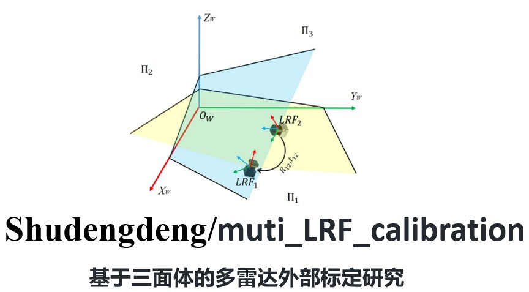
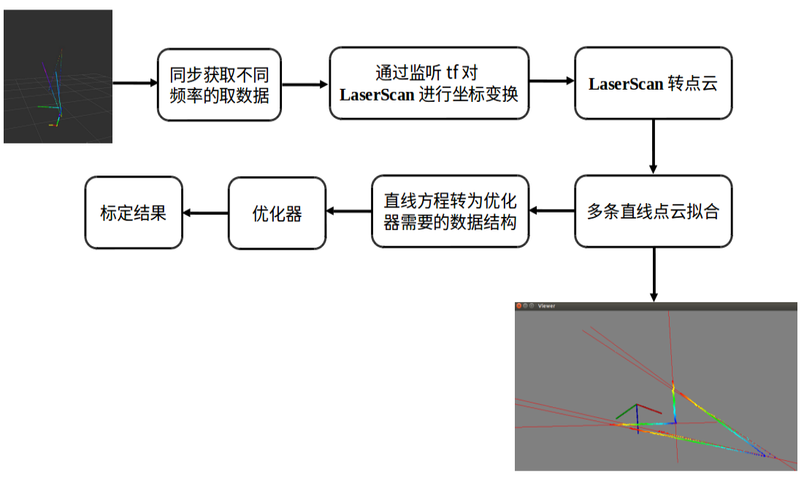

# 简介

室内机器人上搭载三个二维激光雷达，虽然根据雷达安装位置可以初步得到三个雷达相对机器人坐标系的变换矩阵，但由于安装误差和长期使用过程中雷达可能会有细微的偏移，从而导致三个雷达数据无法对准。针对这个问题，使用一种基于三面体的多雷达外部标定方法对雷达数据校准。校准时，机器人只需要寻找室内的墙角场景，采集多组墙角数据即可自动校准。

本人只负责算法的前端部分，即将原始LaserScan数据转为优化器需要的数据结构，该部分已经开发完成。

# 算法框架

